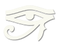

Images
======

----

----

----

   This is the caption of the figure.

   The legend consists of all elements after the caption.

----

   This is the caption of the figure.

   The legend consists of all elements after the caption.

----

   This is the caption of the figure.

   The legend consists of all elements after the caption.
